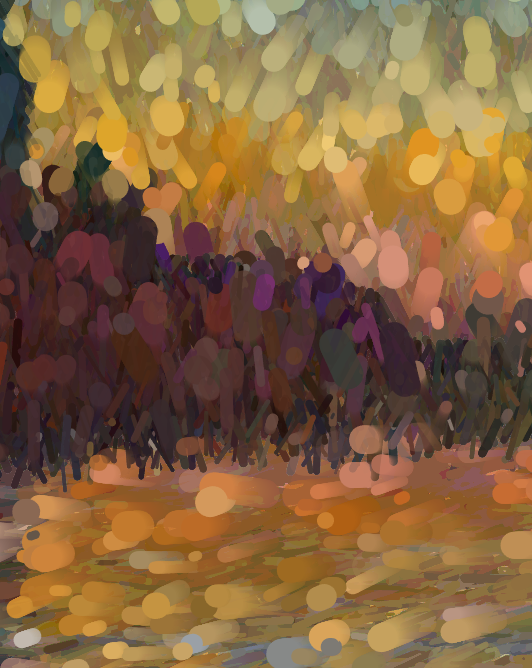
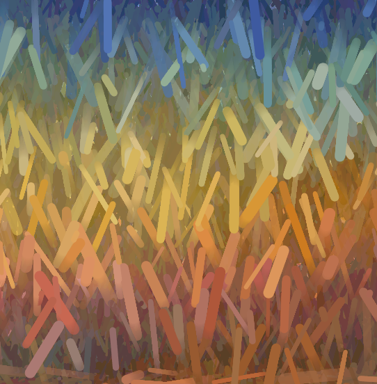
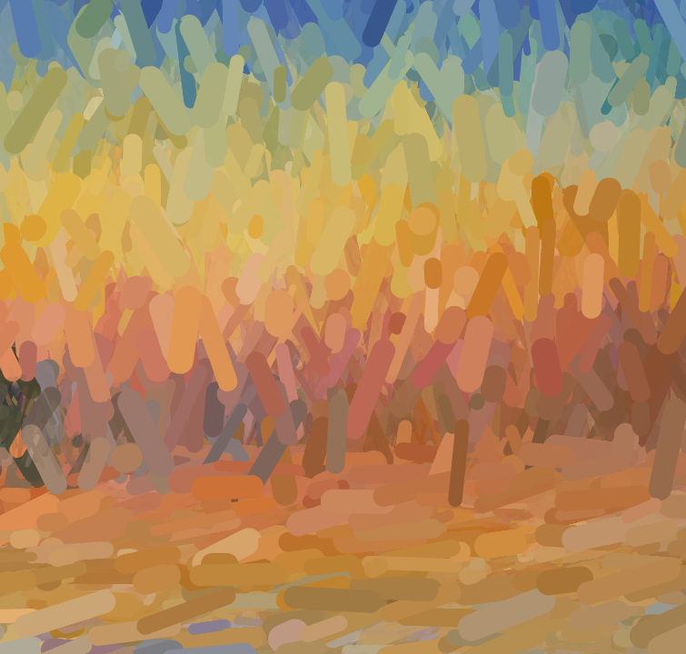
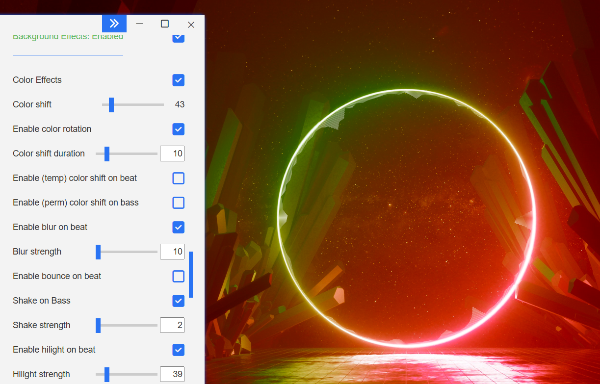
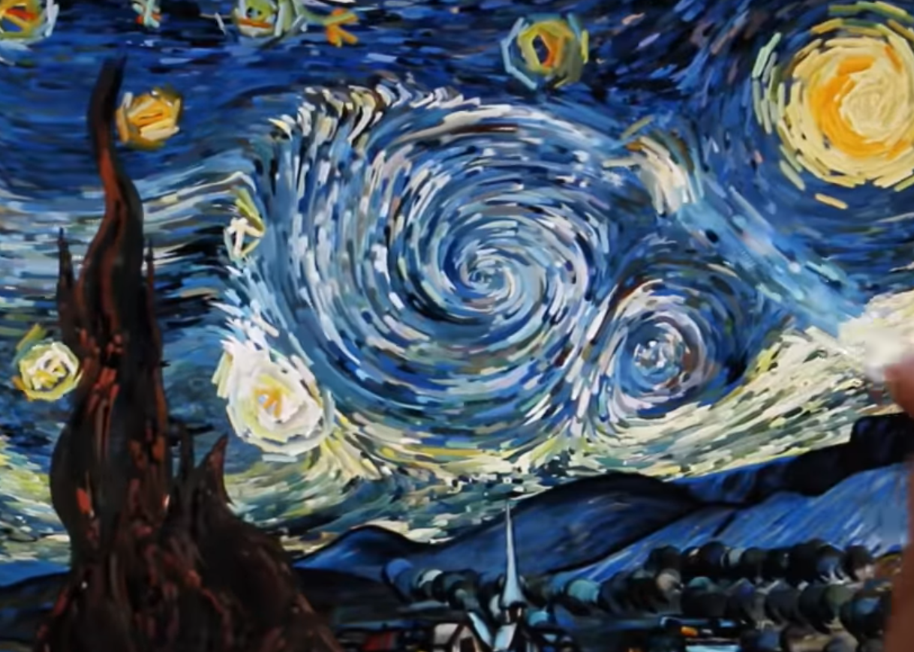

# zche0245_9103_MajorProject
## **Instructions**
- Before watching the work, make sure your device is not muted.
- When you open and run this file, a dark background with the title "click to play" will appear in the center of the screen.
- Click the left mouse button, and the project will start playing automatically. Click again to pause.

The flowing lines will change with the music: when the treble is strong, the lines will become longer; when the bass is strong, the lines will become thicker. Additionally, the overall volume will affect the visuals, making the background brighter or flickering as the volume changes, and the number of flowing lines will also vary with the volume.

*when the bass is strong*



*when the treble is strong*



*when both of them are strong*


## **Details of Individual Approach**
My personal project is using audio to make animations. I mainly change properties such as the length, stroke weight, number of flowing lines, as well as the background grayscale. These values are related to certain audio values, including overall volume and some specific frequency energy values.
I have combined the classical impressionism painting with the modern electronic music to create an interesting hybird interactive art.
*when the bass is strong*


## **Inspiration**
My design inspiration comes from my computer wallpaper, which features music visualization. When music plays, this wallpaper displays a circular visualizer. It also changes color and vibrates with the bass. Therefore, I incorporated variables related to different frequency energy values in my project to create more interesting and varied changes.

*wallpaper from steam workshop* link: (https://steamcommunity.com/sharedfiles/filedetails/?id=1870674201)


Additionally, because we are creating post-impressionist works, Van Gogh's "Starry Night" interactive app also inspired me. In my project, all flowing lines are carefully designed to replicate the direction of the artist's brush strokes.

*"Starry Night" interactive app* link: (https://www.youtube.com/watch?v=Ph1SEFWcL58)


## **Technical Explanation**
### Retrieving Audio Information
My design is based on group code files, incorporating audio and an analyzer. I used Fast Fourier Transform (FFT) to get the energy values in the high and low-frequency regions of the audio spectrum and used Amplitude to get the loudness value of the audio.

*Get audio data*
```
  // Get audio data
  let volume = analyzer.getLevel();
  let spectrum = fft.analyze();
  
  // Get values for low and high frequencies
  let lowFreq = fft.getEnergy(20, 200);
  let highFreq = fft.getEnergy(4000, 20000);
```
### Defining Line Properties
In the initial team file, most line properties were predefined. I made many changes here by introducing global variables for line thickness, length, drawing grayscale, and the number of iterations in the drawing loop. It helps me to bring in Audio values to those values easily.

*Add the audio analyzer values inside the line property values*
```
  // Adjust line properties based on audio data
  strokeweightBase = 3 * (1 + 4 * (lowFreq / 300) * (lowFreq / 300) * (lowFreq / 300));
  lengthBase = 5 * (1 + 3 * (highFreq / 30));
  grayScale = 1400 * volume;
  density = 10 + (200 * volume);
  maxLines = 1000 + (10000 * volume);
```

### Mouse Click to Play
Added a mouse click function to control music playback and the display or disappearance of the playback prompt.

**My technical approach to audio analysis mostly refers to the Week 11 tutorial.* link: (https://canvas.sydney.edu.au/courses/56592/pages/week-11-tutorial?module_item_id=2258248)